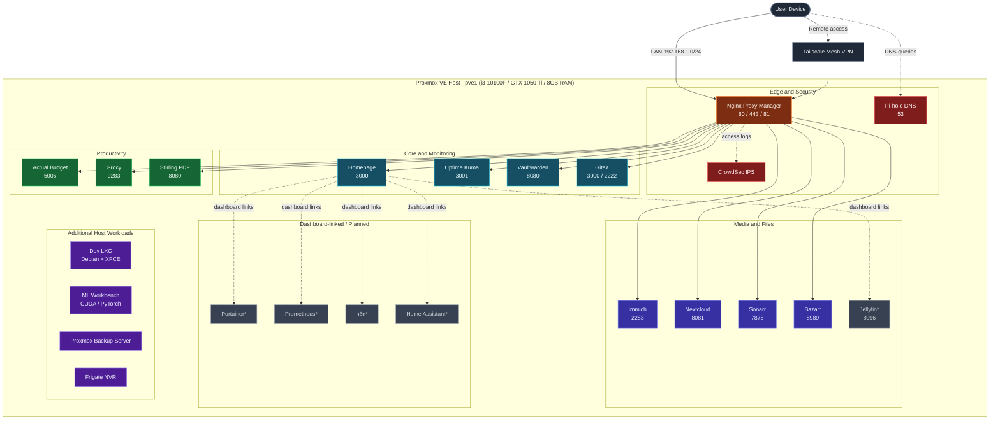

# 🏠 Homelab

*Declarative, Ansible-driven infrastructure for a Proxmox-based homelab — self-hosted media, productivity, security, and monitoring services running across isolated LXC containers.*


---

## Table of Contents

- [Overview](#overview)
- [Tech Stack](#tech-stack)
- [Architecture](#architecture)
- [Hardware](#hardware)
- [Services](#services)
- [Repository Structure](#repository-structure)
- [Getting Started](#getting-started)
- [Configuration and Secrets](#configuration-and-secrets)
- [Security Considerations](#security-considerations)
- [Notes and Considerations](#notes-and-considerations)
- [License](#license)
- [Acknowledgments](#acknowledgments)

## Overview

This repository is the single source of truth for a self-hosted homelab running on a single Proxmox VE node (`pve1`). Ansible drives repeatable, idempotent deployment of Dockerized services into individual LXC containers, so the core stack — reverse proxy, DNS, intrusion prevention, dashboard, monitoring, password vault, and photo backup — can be rebuilt from a clean host with one playbook run. The rest of the catalog deploys with a single `docker compose up -d` per service. DNS, reverse proxying, backups, file sync, and household budgeting all live in version control here instead of being clicked together by hand.

## Tech Stack

| Layer | Technology |
|---|---|
| Hypervisor | Proxmox VE 9.2.4 — LXC containers + QEMU VMs |
| Configuration management | Ansible (playbook-driven, idempotent) |
| Containers | Docker Engine + Docker Compose v2 |
| Reverse proxy / TLS | Nginx Proxy Manager (Let's Encrypt) |
| DNS / ad-blocking | Pi-hole |
| Intrusion prevention | CrowdSec |
| Remote access | Tailscale mesh VPN (no inbound ports exposed to the internet) |
| Networking | Dedicated bridge network `pve1.stefanut` + per-service static LAN IPs |

## Architecture

Each service runs in its own LXC container with a dedicated static IP on the `192.168.1.0/24` LAN (see `services/homepage/services.yaml`) rather than sharing a single Docker host. Nginx Proxy Manager terminates TLS and routes hostnames to each container, Pi-hole resolves DNS for the LAN, and CrowdSec watches the proxy's access logs for abuse. Homepage aggregates every service into one dashboard — including a few that are linked today but don't yet have a docker-compose definition in this repo (marked `*` below).



> **Legend:** Solid arrows follow user/traffic flow; dotted arrows represent DNS queries and log ingestion. Nodes marked `*` are linked from the Homepage dashboard but have no docker-compose definition in this repository yet.

## Hardware

| Component | Detail |
|---|---|
| Host | `pve1` |
| CPU | Intel Core i3-10100F — 4 cores / 8 threads @ 4.30 GHz |
| GPU | NVIDIA GeForce GTX 1050 Ti (4 GB VRAM) |
| RAM | 8 GB DDR4 |
| Storage | 512 GB SATA SSD |
| Hypervisor OS | Proxmox VE 9.2.4 |
| Kernel | Linux 7.0.14-3-pve |
| Virtualization | LXC containers + QEMU VMs |
| Remote networking | Tailscale mesh VPN |

The GPU is also used for CUDA/PyTorch experimentation and Frigate NVR object detection — see **Additional Host Workloads** under [Services](#services) below.

## Services

19 applications are wired into this homelab today: 6 are fully automated by the Ansible playbook, 8 are deployed manually from their own `docker-compose.yml`, and 5 are linked from the dashboard pending a compose file and automation.

### Edge and Security

| Service | Description | Port(s) | Deploy |
|---|---|---|---|
| **Nginx Proxy Manager** | Reverse proxy fronting every web UI; issues and renews Let's Encrypt certificates | `80`, `443`, `81` (admin) | Ansible |
| **Pi-hole** | Network-wide DNS sinkhole that blocks ads and trackers at the DNS layer | `53/tcp+udp`, `8082` (UI) | Manual |
| **CrowdSec** | Parses Nginx access logs and blocks IPs matching known attack signatures | internal | Ansible |

### Core and Monitoring

| Service | Description | Port(s) | Deploy |
|---|---|---|---|
| **Homepage** | Single-pane dashboard linking every service, with live CPU/RAM/disk widgets | `3000` | Ansible |
| **Uptime Kuma** | Polls every service on an interval and alerts when one goes down | `3001` | Ansible |
| **Vaultwarden** | Bitwarden-compatible vault for storing and syncing credentials | `8080` | Ansible |
| **Gitea** | Self-hosted Git remote for private repositories | `3000` (web), `2222` (SSH) | Manual |

### Media and Files

| Service | Description | Port(s) | Deploy |
|---|---|---|---|
| **Immich** | Backs up phone photos/videos with facial recognition and albums | `2283` | Ansible |
| **Nextcloud** | File sync, share links, and office collaboration, backed by MariaDB | `8081` | Manual |
| **Sonarr** | Monitors and automatically fetches TV episodes into the media library | `7878` | Manual |
| **Bazarr** | Fetches matching subtitles for the Sonarr library | `8989` | Manual |
| **Jellyfin**\* | Streams the media library to phones, browsers, and TVs | `8096` | Planned |

### Productivity

| Service | Description | Port(s) | Deploy |
|---|---|---|---|
| **Actual Budget** | Local-first, envelope-style budgeting and personal finance tracker | `5006` | Manual |
| **Grocy** | Tracks groceries, household inventory, chores, and shopping lists | `9283` | Manual |
| **Stirling PDF** | Merges, splits, converts, and OCRs PDFs entirely offline | `8080` | Manual |

### Dashboard-Linked and Planned

Referenced in `services/homepage/services.yaml` but not yet defined as a docker-compose file in this repository:

| Service | Description | Port(s) | Deploy |
|---|---|---|---|
| **Portainer**\* | Web UI for managing containers, images, and volumes | `9443` | Planned |
| **Prometheus**\* | Scrapes and stores time-series metrics for the stack | `9090` | Planned |
| **n8n**\* | Visual, node-based workflow automation builder | `5678` | Planned |
| **Home Assistant**\* | Central hub for home automation and smart-device control | `8123` | Planned |

### Additional Host Workloads

Not containerized services in this repo, but roles the same Proxmox host carries per `hardware/hardware.md`:

- **Development environment** — Debian + XFCE desktop
- **ML workbench** — CUDA / PyTorch experimentation, GPU-accelerated
- **Proxmox Backup Server** — host-level backup target
- **Frigate NVR** — home surveillance / object detection

## Repository Structure

```text
homelab/
├── README.md
├── hardware/
│   └── hardware.md                       # host specs and usage profile
├── ansible/
│   └── group_vars/
│       ├── all.yml                       # global vars: services list, timezone, network name
│       ├── deploy_services.yml           # main playbook
│       └── inventory.ini                 # target LXC IPs (placeholders — replace before use)
└── services/
    ├── actualbudget/docker-compose.yml
    ├── arr-suite/
    │   ├── docker-compose-bazarr.yml
    │   └── docker-compose-sonarr.yml
    ├── crowdsec/docker-compose.yml
    ├── gitea/docker-compose.yml
    ├── grocy/docker-compose.yml
    ├── homepage/
    │   ├── docker-compose.yml
    │   ├── services.yaml                 # dashboard entries — source of truth for LAN IPs
    │   ├── settings.yaml
    │   └── widgets.yaml
    ├── immich/
    │   ├── docker-compose.yml
    ├── nextcloud/docker-compose.yml
    ├── nginx/docker-compose.yml          # Nginx Proxy Manager
    ├── pi-hole/docker-compose.yml
    ├── stirling-pdf/docker-compose.yml
    ├── uptime-kuma/docker-compose.yml
    └── vaultwarden/docker-compose.yml
```

## Getting Started

### Prerequisites

- Proxmox VE host with LXC containers provisioned for each service
- Docker Engine + Docker Compose v2 on every target container
- Python 3 on target nodes (required by Ansible)
- Ansible on the control node, with SSH key access to every container
- (Optional) Tailscale on the control node for remote management

### Automated deployment (6 services)

1. Clone the repository:
   ```bash
   git clone https://github.com/moanast/homelab.git
   cd homelab
   ```
2. Replace the placeholder addresses in `ansible/group_vars/inventory.ini` with your real LXC IPs.
3. Review `ansible/group_vars/all.yml` — adjust `default_timezone`, `docker_network_name`, or `homelab_services` if needed.
4. Set any required secrets first (see [Configuration and Secrets](#configuration-and-secrets)).
5. Run the playbook from the repository root:
   ```bash
   ansible-playbook -i ansible/group_vars/inventory.ini ansible/group_vars/deploy_services.yml
   ```

### Manual deployment (remaining services)

For services not yet wired into the playbook loop (Actual Budget, Bazarr, Gitea, Grocy, Nextcloud, Pi-hole, Sonarr, Stirling PDF):

```bash
cd services/<service-name>
docker compose up -d
```

## Configuration and Secrets

No secrets are committed in plaintext. The following must be supplied — via environment variables or an untracked `.env` file — before first run:

| Service | Required before first run |
|---|---|
| Nextcloud | `MYSQL_ROOT_PASSWORD` for the `db` service, plus an app database password |
| Pi-hole | `WEBPASSWORD` for the admin UI |
| Vaultwarden | `DOMAIN`, matching the hostname you'll access it from (needed for WebAuthn and attachments) |
| Immich | An `.env` file with `UPLOAD_LOCATION` and, optionally, `IMMICH_VERSION`; the compose file also expects `redis` and `database` services, which should be added from Immich's official compose file |
| Homepage | `HOMEPAGE_ALLOWED_HOSTS`, if the dashboard's IP or hostname changes |

## Security Considerations

- No secrets are committed in plaintext; sensitive values are left blank in the compose files and supplied at deploy time.
- CrowdSec ingests Nginx Proxy Manager's access logs and blocks IPs matching known attack signatures (`crowdsecurity/linux`, `crowdsecurity/nginx` collections).
- Pi-hole blocks ad and tracker domains at the DNS layer for every device on the LAN.
- Remote access goes through Tailscale's mesh VPN rather than forwarding ports to the internet.
- The LAN firewall (pfSense/OPNsense) runs independently of the Proxmox host, so routing survives `pve1` reboots or maintenance.

## Notes and Considerations

- Each service gets its own static LAN IP (see `services/homepage/services.yaml`) instead of sharing a single Docker host, which is why services publishing the same container-internal port — Gitea and Homepage both default to `3000`; Vaultwarden and Stirling PDF both default to `8080` — don't collide today. Keep that in mind if you ever consolidate multiple services onto one container or IP.
- Only six services (CrowdSec, Homepage, Immich, Nginx Proxy Manager, Uptime Kuma, Vaultwarden) are declarative through `deploy_services.yml` today. The rest run via `docker compose up -d` until they're added to `homelab_services` in `all.yml` and the playbook loop.
- `inventory.ini` ships with placeholder IPs (`10.0.0.10`, `10.0.0.11`) — replace them with real addresses before running the playbook.

## License

No license file is currently included, so all rights are reserved by default — the code is visible but not legally licensed for reuse. To permit reuse, consider adding an [MIT](https://choosealicense.com/licenses/mit/) or [Apache 2.0](https://choosealicense.com/licenses/apache-2.0/) license.

## Acknowledgments

Built on top of great open-source projects: [Proxmox VE](https://www.proxmox.com/), [Ansible](https://github.com/ansible/ansible), [Docker](https://www.docker.com/), [Nginx Proxy Manager](https://github.com/NginxProxyManager/nginx-proxy-manager), [Pi-hole](https://github.com/pi-hole/pi-hole), [CrowdSec](https://github.com/crowdsecurity/crowdsec), [Homepage](https://github.com/gethomepage/homepage), [Immich](https://github.com/immich-app/immich), [Nextcloud](https://github.com/nextcloud/server), [Uptime Kuma](https://github.com/louislam/uptime-kuma), [Vaultwarden](https://github.com/dani-garcia/vaultwarden), [Gitea](https://github.com/go-gitea/gitea), [Grocy](https://github.com/grocy/grocy), [Actual Budget](https://github.com/actualbudget/actual), [Stirling PDF](https://github.com/Stirling-Tools/Stirling-PDF), [Sonarr](https://github.com/Sonarr/Sonarr) / [Bazarr](https://github.com/morpheus65535/bazarr), and [Tailscale](https://tailscale.com/).
